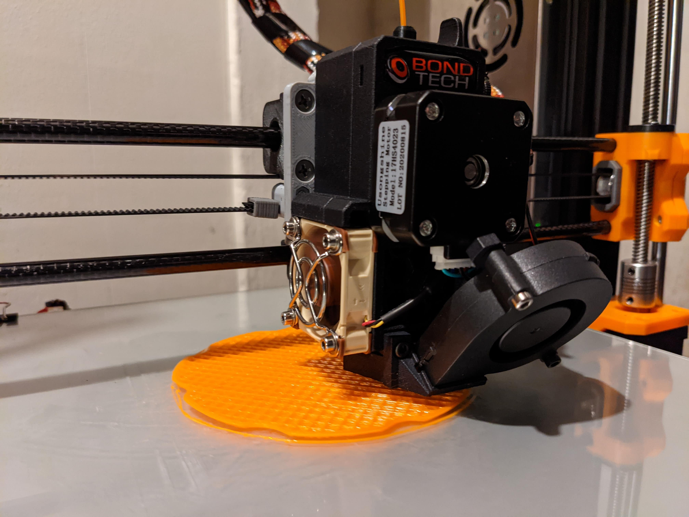

# giant-prusa

### 🧰 currently a work in progress 🛠️

A repo that converts an Anet A8 Plus into a GIANT Prusa MK3S with a few other slight modifications.

### Upgrades ⏫

Links to all the of the parts/software are included below:
- <a href="https://www.amazon.com/BIGTREETECH-Printer-Control-Smoothieboard-Upgrade/dp/B082YTYDCK/ref=sr_1_2?dchild=1&keywords=skr+1.4+turbo&qid=1611026087&sr=8-2" target="_blank"> BIGTREETECH SKR 1.4 Turbo </a>
    - <a href="https://www.amazon.com/gp/product/B07YW7BM68/ref=ppx_yo_dt_b_asin_title_o03_s00?ie=UTF8&psc=1" target="_blank"> BIGTREETECH TMC2209 Stepper Motor Drivers </a>
    - <a href="https://www.amazon.com/gp/product/B0711FVD48/ref=ppx_yo_dt_b_asin_title_o03_s00?ie=UTF8&psc=1" target="_blank"> 40mm x 10mm Fan (2 Pack) </a>
- <a href="https://www.amazon.com/gp/product/B07TJWSV51/ref=ppx_yo_dt_b_asin_title_o02_s00?ie=UTF8&psc=1" target="_blank"> BIGTREETECH TFT24 V1.1 </a>
- <a href="https://www.amazon.com/gp/product/B01CMC50S0/ref=ppx_yo_dt_b_asin_title_o09_s00?ie=UTF8&psc=1" target="_blank"> Raspberry Pi 3 B+ </a>
    - <a href="https://docs.fluidd.xyz/" target="_blank"> Fluidd </a>
    - <a href="https://klipper3d.org" target="_blank"> Klipper </a>
        - <a href="https://www.amazon.com/gp/product/B07RVG34WR/ref=ppx_yo_dt_b_asin_title_o02_s00?ie=UTF8&psc=1" target="_blank"> MP1584EN DC-DC Buck Converter </a>
        - <a href="https://www.amazon.com/gp/product/B076DW7M5S/ref=ppx_yo_dt_b_asin_title_o01_s00?ie=UTF8&psc=1" target="_blank"> Left-Angle Micro B USB Cable </a>
- <a href="https://www.bondtech.se/product/prusa-i3-mk2-5-mk3-extruder-upgrade/" target="_blank"> Bondtech Prusa i3 MK2.5/3 Extruder Upgrade</a>
- <a href="https://www.amazon.com/gp/product/B079H1S9BN/ref=ppx_yo_dt_b_asin_title_o01_s00?ie=UTF8&psc=1" target="_blank"> Genuine E3D V6 Hotend </a>
- <a href="https://www.amazon.com/gp/product/B01M1777XK/ref=ppx_yo_dt_b_asin_title_o02_s00?ie=UTF8&psc=1" target="_blank"> Capacitive Auto Bed Leveling </a>
- <a href="https://www.amazon.com/gp/product/B07ZCSXNF3/ref=ppx_yo_dt_b_asin_title_o00_s00?ie=UTF8&psc=1" target="_blank"> Mechanical Endstop Limit Switches </a>
- <a href="https://www.amazon.com/gp/product/B071RSDYW4/ref=ppx_yo_dt_b_asin_title_o03_s00?ie=UTF8&psc=1" target="_blank"> Igus Drylin Polymer Bearings </a>
- <a href="https://www.amazon.com/gp/product/B07BPKWM9D/ref=ppx_yo_dt_b_asin_title_o05_s00?ie=UTF8&psc=1" target="_blank"> GT2 Idler Pulley (20 Teeth) </a>
- <a href="https://www.amazon.com/gp/product/B075CM413G/ref=ppx_yo_dt_b_asin_title_o09_s00?ie=UTF8&psc=1" target="_blank"> 623ZZ Bearings (X-Axis) </a>
- <a href="https://www.amazon.com/gp/product/B07FVXM3RK/ref=ppx_yo_dt_b_asin_title_o04_s00?ie=UTF8&psc=1" target="_blank"> 693ZZ Bearings (Y-Axis) </a>
- <a href="https://www.amazon.com/gp/product/B07GGLYX9V/ref=ppx_yo_dt_b_asin_title_o01_s00?ie=UTF8&psc=1" target="_blank"> 2020 Right-Angle Bracket </a>
- <a href="https://www.amazon.com/gp/product/B07Y6CN9J4/ref=ppx_yo_dt_b_asin_title_o00_s00?ie=UTF8&psc=1" target="_blank"> T8 Lead Screw POM Nuts (2 Pack) </a>

### Just so you know 💭

#### This is NOT a beginner project, and definitely NOT for the faint of heart.

##### It is currently in active development, and being updated regularly.

With that being said, if you have any questions, feel free to ask in the Discussion tab.

- All of the models with **`remix`** in the name are parts that I modified to work with this printer. Credits to all of the original authors are listed below.

### NOTE ⚠️

- **PLEASE** make sure that your printer is calibrated before attempting to print these parts. A lot of these parts can be printed without supports but there some that require them. Another option if you don't have a printer available to you would be to order them from an online 3D printing service.

You **WILL** have to measure and cut the Carbon Fiber Rods down to size, **PLEASE** use the proper PPE, measure twice to be precise and **BE SAFE** while cutting the rods down to size. You don't want to breathe any of the dust produced while cutting as it extremely hazardous to your lungs.

### To-Do List 📝

* [ ] Add photos
* [x] Add custom firmware
* [ ] Add list of parts needed
* [x] Create an Instruction Wiki (Under Construction 🛠️)

### Shout Outs 📣

I would like to give a huge thank you to all of these folks who's designs helped me frankenstein this whole thing together, without your help this would've been a lot more difficult.

- **3Displacement** - Extruder Carriage | <a href="https://www.thingiverse.com/thing:3942196" target="_blank"> thing:3942196 </a>
- **pekcitron** - X-Axis (BearExxa) | <a href="https://www.thingiverse.com/thing:4362586" target="_blank"> thing:4362586 </a>
- **anotherhowie** - X-Axis Belt Holder | <a href="https://www.thingiverse.com/thing:2134843" target="_blank"> thing:2134843 </a>
- **good_idea**
    - X-Axis Bearing Blocks | <a href="https://www.thingiverse.com/thing:1424346" target="_blank"> thing:1424346 </a>
    - Y-Axis Bearing Blocks | <a href="https://www.thingiverse.com/thing:1445162" target="_blank"> thing:1445162 </a>
- **Maxinoha** - Y-Axis Belt Holder/ Motor Mount/ Idler-Tensioner | <a href="https://www.thingiverse.com/thing:2394683" target="_blank"> thing:2394683 </a>
- **danimod** - Y-Axis Rod Mount | <a href="https://www.thingiverse.com/thing:3738204" target="_blank"> thing:3738204 </a>
- **Prusa 3D** - Z Axis Top/Bottom | <a href="https://www.prusa3d.com/prusa-i3-printable-parts/" target="_blank"> Original Prusa i3 MK3S </a>
